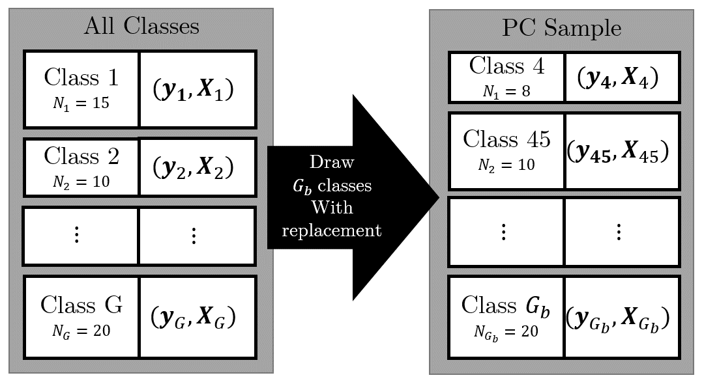
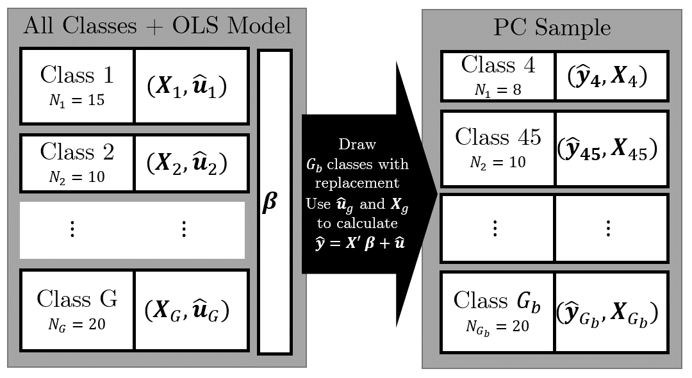

::: {.fullwidth}
# 2 Clustered and Grouped Samples

In this problem, you will analyze data from Project STAR, originally analyzed in Krueger
(1999). Project STAR was a three-year research project consisting of an intervention with preschoolers in Lane County, Oregon, United States. Consider the following bivariate regression model,
$$ Y_{ig} = \beta_0 + \beta_1 x_i + e_{ig}$$
where $Y_{ig}$, is the test score of student $i$ in class $g$ and class size $x_g$. The goal of the research is to understand how class-size affects student outcomes. This question partially replicates the example in Section 8.2 in Angrist and Piscke (2008).

### a) Random Sampling I
An important aspect of the STAR project is that the students are randomly assigned
to classes. What does this imply about the consistency and unbiasedness of the OLS
estimator?

- Random assignment implies **random sampling** of variables, meaning they should be **i.i.d**
- Given the assumptions *OLS.1* and *OLS.2* this implies that the estimators are consistent

### b) OLS Estimation
```{r SETUP, message=FALSE, warning=FALSE}
## Libraries
library(stargazer)
library(sandwich)
library(lfe)
library(tidyverse)
library(DT)
library(furrr)

plan(strategy = "multisession", workers = 2)

## LOAD `KruegerStar` DATA
load("data/KruegerStar.Rda")

## SHOW DATA (that poor kid in the first observation :/)
head(KruegerStar)
```
Estimate the model by OLS and interpret what you estimate for $\beta_1$. Calculate both
conventional and robust standard errors.
```{r message=FALSE, warning=FALSE}
## LM ESTIMATION
model_1 <- lm(pscore ~ cs,
              data = KruegerStar)

## NORMAL STANDARD ERRORS
se = c(1.655, 0.090)

## ROBUST STANDARD ERRORS
cov_1 <- vcovHC(x = model_1, type = "HC1")
robust_se = sqrt(diag(cov_1))


## SHOW RESULTS
stargazer(model_1, model_1,
          type = "text",
          se = list(se, robust_se))
```
Is there a big difference?

- Difference is virtually not noticeable in for *class size* and negligible for the *constant*

### c) Random Sampling (?) II
While the students are randomly assigned to classrooms, students in the same classroom where exposed to the same teacher and classroom environment. What does this imply about the consistency and the asymptotic distribution of the OLS estimator?

- There might be correlations of the error terms *within groups*
- Typically, conventional standard errors *underestimate* the true standard errors because they do not take this within-group correlation into account.

### d) Cluster Robust Standard Errors
Estimate the standard errors for $\beta_1$ using cluster robust standard errors (The R
package "plm" will help here. There are other packages that do similar calculations).
```{r CLUSTER ROBUST SE, message=FALSE, warning=FALSE}

model_2 <- felm(pscore ~ cs|0|0|classid,
                data = KruegerStar)

## SAVE CLUSTER STANDARD ERRORS FOR DISPLAY
se_clust <- c(4.573, 0.232)
## DISPLAY ALL MODELS
stargazer(model_1, model_1, model_2,
          type = "text",
          se = list(se,
                    robust_se,
                    se_clust))
```

# e) Block Bootstrap
Estimate the standard errors for $\beta_1$ using block bootstrap. The block bootstrap preserves the group structure in the original dataset by drawing blocks of data defined 
by the groups. In this case, you will create and estimate the model on bootstrap samples where you draw whole classes. How do the block-bootstrap standard errors compare to the cluster robust standard errors?

We follow the approaches of *Cameron, A. C., J. B. Gelbach, and D. L. Miller (2008): Bootstrap-based improvements for inference with clustered errors*

## Pairs Cluster Bootstrap
Resample the clusters itself:

- We have $G$ clusters $(\mathbf{y}_g, \mathbf{X}_g)$, each with $N_g$ observations
- For the bootstrap, we draw $G_b$ clusters *with replacement*, where $G_b$ can be half the number of original clusters




### 1. This function draws $G_b$ random classes from the original sample
```{r PAIRS CLUSTER BOOTSTRAP, message=FALSE}
# SAMPLE FROM data.frame
pc_bs_sample <- function(G_b, pop_data){
  ## Create Random Index of N_i elemnts of pop_data  
  index <- sample(pop_data$classid,
                  size = G_b,
                  replace = T)
  
  ## Select N_i elements from pop_data
  pop_data[pop_data$classid %in% index, c("pscore", "cs")]
}

pc_bs_sample(100, KruegerStar) %>% 
  head()
```

### 2. This function uses the sample generated by `pc_bs_sample()`, estimates an OLS model and returns the coefficients
```{r ,message=FALSE}
## THIS FUNCTION ESTIMATES A MODEL AND GET COEFFICIENTS USING THE RANDOM SAMPLE
get_pc_coefficients <- function(index,
                                size = 0.5,
                                data){
  
  n_classes <- round(length(unique(data$classid)) * size,digits = 0)
  
  message(paste("Sample", index))
  ## Estimate model
  model <- lm(pscore ~ cs,
              data = pc_bs_sample(G_b = n_classes,
                                  pop_data = data))
  ## Get and return coefficients
  summary(model)$coefficients[1:2,1]
}

get_pc_coefficients(index = 1,
                    size = 1,
                    data = KruegerStar)
```

## 3. Here we do the PC bootstrap 50000 times:

```{r, message=FALSE}
pc_coefficients <- future_map_dfr(1:50000,
                                  .f = get_pc_coefficients,
                                  data = KruegerStar,
                                  size = 1,
                                  .options = furrr_options(seed = T))

head(pc_coefficients)
```

### 4. Calculate standard errors as variance over the bootstraps:
$$s_{\beta_{i}} = \left(  \frac{1}{G_b-1} \sum_{g=1}^{G_b} (\hat{\beta}_{ig} - \bar{\hat{\beta_{ig}}}) \right)^{\frac{1}2}$$
```{r, message=FALSE}
## Save standard errors in a vector
pc_boot_se <- c(sd(pc_coefficients$`(Intercept)`),
                sd(pc_coefficients$cs)
)

## Present results
rbind("normal" = se,
      "robust" = robust_se,
      "cluster_robust" = se_clust,
      "pc_bootstrap" = pc_boot_se
)
```

## Wild (Residual) Bootstrap

Instead of resampling the clusters, we resample the residuals from the estimated model on the complete sample

- In the estimated model have $i$ clusters $(\mathbf{\hat{y}}_i, \mathbf{X}_i, \mathbf{\hat{u}}_i)$, each with $N_i$ observations
- We also have the coefficients $\beta_0$ and $\beta_1$ from the conventional OLS estimation
- We now draw $G_b$ classes and use the regressors, resiudals and coefficients to calculate $\hat{\mathbf{y}} = \mathbf{X}' \mathbf{\beta} + \mathbf{\hat{u}}$




### 1. This function creates a dataset containing $G_b$ classes with pscore calculated via the wild bootstrap method using Rademacher weights
```{r, message=FALSE}
wild_bs_sample <- function(G_b,
                           data){
  
  ## Derive the OLS estimates and residuals
  model <- lm(pscore ~ cs, data = data)
  
  ## Get X and u_hat
  full_data <- tibble(classid = data$classid,
                      cs = data$cs,
                      u_hat = model$residuals) %>% 
    group_by(classid) %>% 
    mutate(weight = sample(c(1, -1),
                           size = 1,
                           replace = F))
  
  ## Get coefficients
  beta_0 <- model$coefficients[1]
  beta_1 <- model$coefficients[2]
  
  ## Index of classes to sample
  index <- sample(full_data$classid,
                  size = G_b,
                  replace = T)
  
  ## Select G_b classes from full_data
  full_data[full_data$classid %in% index, c("cs", "u_hat", "weight")] %>% 
    transmute(pscore = beta_0 + beta_1 * cs + u_hat*weight,
              cs = cs)
}

wild_bs_sample(data = KruegerStar) %>% 
  head()
```

### 2. This function uses the sample generated by `wild_bs_sample()`, estimates an OLS model and returns the coefficients
```{r, message=FALSE}
## THIS FUNCTION ESTIMATES A MODEL AND GET COEFFICIENTS USING THE RANDOM SAMPLE
get_wild_coefficients <- function(index,
                                  size = 0.5,
                                  data){
  message(paste("Sample", index))
  
  ## Sampel size (number of clusters to draw)
  n_classes <- round(length(unique(data$classid)) * size ,digits = 0)
  
  ## Estimate model
  model <- lm(pscore ~ cs,
              data = wild_bs_sample(G_b = n_classes,
                                    data = data))
  ## Get and return coefficients
  summary(model)$coefficients[1:2,1]
}

get_wild_coefficients(index = 1,
                      size = 1,
                      data = KruegerStar)
```

## 3. Here we do the wild bootstrap 50000 times:
```{r, message=FALSE}
wild_coefficients <- future_map_dfr(1:50000,
                                    .f = get_wild_coefficients,
                                    data = KruegerStar,
                                    size = 1,
                                    .options = furrr_options(seed = T)
)

head(wild_coefficients)
```

### 4. Calculate standard errors as variance over the bootstraps:
$$s_{\beta_{ib}} = \left(  \frac{1}{B-1} \sum_{b=1}^B (\hat{\beta}_{ib} - \bar{\hat{\beta_{ib}}}) \right)^{\frac{1}2}$$
```{r, message=FALSE}
wild_boot_se <- c(sd(wild_coefficients$`(Intercept)`),
                  sd(wild_coefficients$cs)
)

rbind("normal" = se,
      "robust" = robust_se,
      "cluster_robust" = se_clust,
      "pc_bootstrap" = pc_boot_se,
      "wild_bootstrap" = wild_boot_se
)
```
:::
