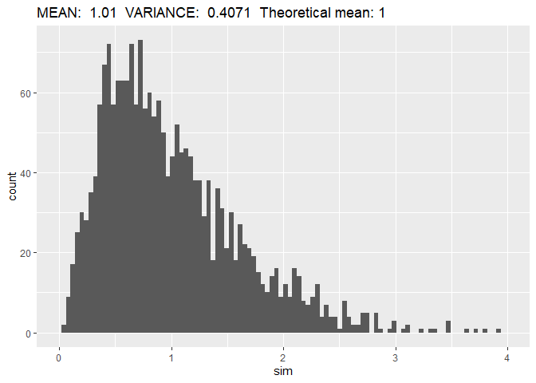
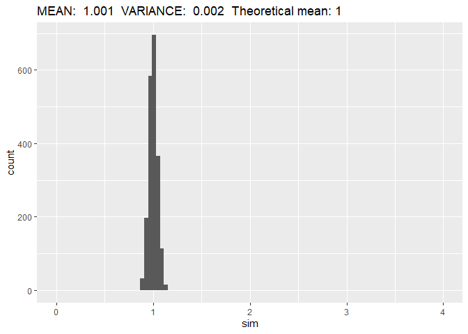

<!-- README.md is generated from README.Rmd. Please edit that file -->

# Problem Set 1

# Monte Carlo Simulation I

``` r
## SETUP

library(tidyverse)

## Mean simulation function
normmean <- function(iter, n, mean, sd){
  mean(rnorm(n = n,
             mean = mean,
             sd =  sd))
}
## Mean simulation function
normmean_simulation <- function(r, n, mean, sd){
  map_dbl(.x = 1:r,
          .f = normmean,
          n = n,
          mean = mean,
          sd = sd)
}
```

## a) Mean=1, sd=2, n=100

``` r
## Generate 1000 normal variable means
sim <- normmean_simulation(r = 1000,
                           n = 100, mean = 1, sd = 2 )

## Histogram
ggplot(mapping = aes(x = sim)) +
  geom_histogram(bins = 30) +
  labs(title = paste("MEAN: ", round(mean(sim),digits = 3),
                     " VARIANCE: ", round(var(sim),digits = 4),
                     " Theoretical variance:", 4/100))
```

<!-- -->

## c) I Mean=1, sd=2, n=5

``` r
## Generate 1000 normal variable means
sim <- normmean_simulation(r = 1000,
                           n = 5, mean = 1, sd = 2 )

## Histogram
ggplot(mapping = aes(x = sim)) +
  geom_histogram(bins = 30) +
  labs(title = paste("MEAN: ", round(mean(sim),digits = 3),
                     " VARIANCE: ", round(var(sim),digits = 4),
                     " Theoretical variance:", 4/5))
```

<!-- -->

## c) II Mean=1, sd=2, n=1000

``` r
## Generate 1000 normal variable means
sim <- normmean_simulation(r = 1000,
                           n = 1000, mean = 1, sd = 2 )

## Histogram
ggplot(mapping = aes(x = sim)) +
  geom_histogram(bins = 30) +
  labs(title = paste("MEAN: ", round(mean(sim),digits = 3),
                     " VARIANCE: ", round(var(sim),digits = 4),
                     " Theoretical variance:", 4/1000))
```

<!-- -->

## d) Chi Squared

``` r

## Random Chi squared function
random_chisq <- function(iter, df, mean, sd){
  sum(rnorm(n = df,
            mean = mean,
            sd =  sd)^2)
}

## Chi^2 mean function
chimean <- function(iter, df, n, mean, sd){
  mean(map_dbl(1:n,
               .f = random_chisq,
               df = df,
               mean = mean,
               sd = sd))
  
}
## Chi^2 simulation function
chi_simulation <- function(r, df, n, mean, sd){
  map_dbl(.x = 1:r,
          .f = chimean,
          df = df,
          n = n,
          mean = mean,
          sd = sd)
}
```

## e) I Mean=0, sd=1, n=5

``` r
## Generate 1000 chi^2 variable means
sim <- chi_simulation(r = 1000,
                      n = 5,
                      df = 1, mean = 0, sd = 1 )

## Histogram
ggplot(mapping = aes(x = sim)) +
  geom_histogram(bins = 30) +
  labs(title = paste("MEAN: ", round(mean(sim),digits = 3),
                     " VARIANCE: ", round(var(sim),digits = 4),
                     " Theoretical mean:", 1))
```

<!-- -->

## e) II Mean=0, sd=1, n=100

``` r
## Generate 1000 chi^2 variable means
sim <- chi_simulation(r = 1000,
                      n = 100,
                      df = 1, mean = 0, sd = 1 )

## Histogram
ggplot(mapping = aes(x = sim)) +
  geom_histogram(bins = 30) +
  labs(title = paste("MEAN: ", round(mean(sim),digits = 3),
                     " VARIANCE: ", round(var(sim),digits = 4),
                     " Theoretical mean:", 1))
```

<!-- -->

## e) III Mean=0, sd=1, n=1000

``` r
## Generate 1000 chi^2 variable means
sim <- chi_simulation(r = 1000,
                      n = 1000,
                      df = 1, mean = 0, sd = 1 )

## Histogram
ggplot(mapping = aes(x = sim)) +
  geom_histogram(bins = 30) +
  labs(title = paste("MEAN: ", round(mean(sim),digits = 3),
                     " VARIANCE: ", round(var(sim),digits = 4),
                     " Theoretical mean:", 1))
```

<!-- -->

## f) Hypothesis test setup

``` r
hyptest <- function(iter, n){
  ## Generate n chi squared variables
  sim <- map_dbl(.x = 1:n,
          .f = random_chisq,
          df = 1,
          mean = 0,
          sd = 1)
  ## Do a t-test with mu = 1
  t.test(sim, mu=1)$p.value
}
```

## f) I Hypothesis test with n=5

``` r
## Do 1000 hypothesis tests
result_5 <- map_dbl(1:1000,
        .f = hyptest,
        n = 5)

## Fraction of significant tests
mean(result_5 < 0.05)
#> [1] 0.178
```

## f) II Hypothesis test with n=100

``` r
## Do 1000 hypothesis tests
result_100 <- map_dbl(1:100,
        .f = hyptest,
        n = 100)

## Fraction of significant tests
mean(result_100 < 0.05)
#> [1] 0.09
```

## f) III Hypothesis test with n=1000

``` r
## Do 1000 hypothesis tests
result_1000 <- map_dbl(1:100,
        .f = hyptest,
        n = 1000)

## Fraction of significant tests
mean(result_1000 < 0.05)
#> [1] 0.05
```
